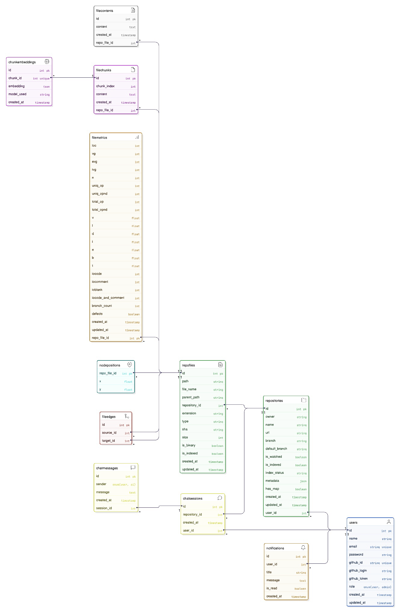

  

<!-- project overview -->

> GitMap is your companion for making sense of unfamiliar codebases. Instead of digging through endless folders, you get a clear visual map that shows how files are connected, letting you see the bigger picture at a glance.

>You can even ask natural language questions about any file, and the built-in AI agent will give you clear, contextual answers. Whenever something changes in your repository, GitMap keeps you in the loop with simple notifications, so you’re never caught off guard. On top of that, it uses machine learning to predict which parts of the code might be unstable, helping you spot risks early and focus your attention where it matters most.

>Whether you’re onboarding to a new project or keeping track of your own, GitMap turns messy repos into something you can actually understand and trust.

  

<!-- System Design -->

### ER Diagram

View the live ER diagram here: [Eraser Workspace](https://app.eraser.io/workspace/NIzKPZnY8ZkSBtb8iS99?origin=share)

### System Architecture

  

<!-- Project Highlights -->
<!-- Project Highlights -->

### Why GitMap Stands Out

- **Interactive Code Map** : instantly see how files connect through imports and dependencies.  
- **Natural Language Q&A with AI Agent** : ask plain-English questions about any file and explore the repo with contextual answers and guidance.  
- **Change Notifications** : stay up to date with simple alerts whenever your repository changes.  
- **Code Stability Predictions** : machine learning highlights risky or unstable areas of the code.  

  

<!-- Demo -->

### User Screens (Web)

| Login screen                            | Register screen                       |
| --------------------------------------- | ------------------------------------- |
|  |  |

| Dashboard screen                            | My Repos screen                       |
| --------------------------------------- | ------------------------------------- |
|  |  |

| Map screen                            | Notifications screen                       |
| --------------------------------------- | ------------------------------------- |
|  |  |

| Map Generation                          |
| --------------------------------------- |
|  |

| AI Agent                       |
| --------------------------------------- |
|  |

| Machine Learning                        |
| --------------------------------------- |
|  |

  

<!-- Development & Testing -->

| Services                            | Validation                       | Testing                        |
| --------------------------------------- | ------------------------------------- | ------------------------------------- |
|  |  |  |

  

### AI Agent

**Simple Inputs:** The user just provides a GitHub repository URL.

**Smart Processing:** The system fetches code and commits, then the AI agent indexes and analyzes the repository.

**Clear Outputs:** The AI agent delivers easy-to-understand answers and insights based on the code.

  

| AI Agent Explanation                       |
| --------------------------------------- |
|  |

  

<!-- Deployment -->

### API calls

| Postman API 1                            | Postman API 2                       | Postman API 3                        |
| --------------------------------------- | ------------------------------------- | ------------------------------------- |
|  |  |  |

  

### Linear Board

| Board                        |
| --------------------------------------- |
|  |
